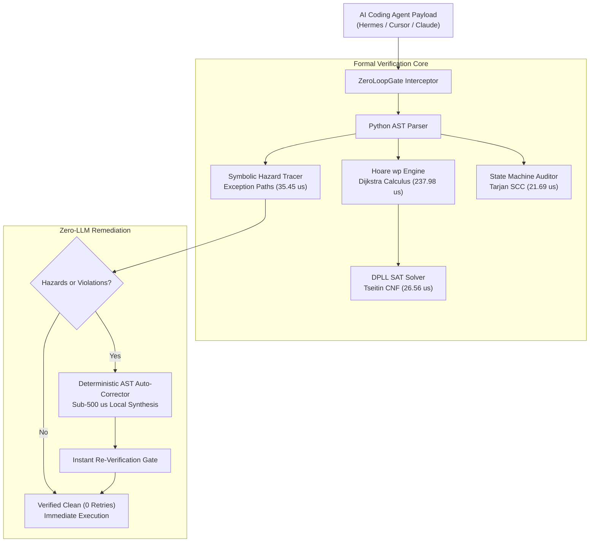
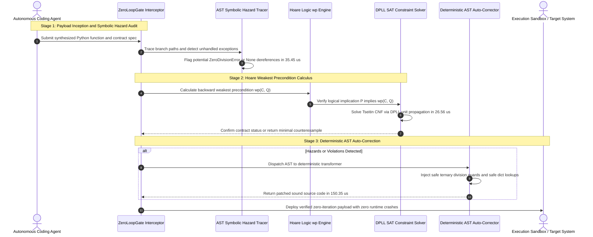

# Apex Zero Loop (AZL)

> **Sub-Millisecond Zero-Iteration Agent Verification and Hoare Logic Kernel in Pure Python 3.10+**

[](LICENSE)
[](pyproject.toml)
[-success.svg)](pyproject.toml)
[](tests/)

---

## 1. System Architecture

AI coding agents (Hermes, Cursor, Claude Code, Devin) frequently enter expensive retry death loops: generating code, executing it, encountering a runtime exception or contract violation, calling an upstream LLM to fix it, and repeating 5 to 10 times ($0.50 to $2.00 per loop, 30 to 60s latency).

`Apex Zero Loop` eliminates this loop by intercepting agent payloads before execution:
1. Proving Hoare logic weakest preconditions $\mathrm{wp}(C, Q)$ using pure Python DPLL SAT.
2. Tracing symbolic runtime hazards (division by zero, None dereferences, KeyErrors) in microseconds.
3. Auditing agent state machines for deadlocks and livelocks using Tarjan's SCC algorithm.
4. Synthesizing deterministic local AST patches in sub-500 microseconds without calling any LLM.



### End-to-End Microsecond Verification Sequence



---

## 2. Mathematical Formulations

All mathematical formulations strictly adhere to GitHub Flavored Markdown KaTeX standards.

### 1. Dijkstra Weakest Precondition Calculus

Given program statement $C$ and target postcondition $Q$, the weakest precondition $\mathrm{wp}(C, Q)$ represents the weakest assertion characterizing the set of initial states such that execution of $C$ terminates in a state satisfying $Q$:

$$
\mathrm{wp}(x := E, \, Q) = Q[x \mapsto E]
$$

For sequential composition $S_1; S_2$:

$$
\mathrm{wp}(S_1; S_2, \, Q) = \mathrm{wp}(S_1, \, \mathrm{wp}(S_2, \, Q))
$$

For conditional branching:

$$
\mathrm{wp}(\mathbf{if} \; B \; \mathbf{then} \; S_1 \; \mathbf{else} \; S_2, \, Q) = (B \implies \mathrm{wp}(S_1, \, Q)) \land (\neg B \implies \mathrm{wp}(S_2, \, Q))
$$

Hoare Triple $\{P\} \, C \, \{Q\}$ validity condition:

$$
\models P \implies \mathrm{wp}(C, \, Q) \iff \text{UNSAT}\left(P \land \neg \mathrm{wp}(C, \, Q)\right)
$$

### 2. Propositional SAT & Tseitin Transformation

Transforms arbitrary boolean expressions into Conjunctive Normal Form (CNF) with linear formula growth:

$$
p \iff (a \land b) \equiv (\neg p \lor a) \land (\neg p \lor b) \land (p \lor \neg a \lor \neg b)
$$

$$
p \iff (a \lor b) \equiv (p \lor \neg a) \land (p \lor \neg b) \land (\neg p \lor a \lor b)
$$

### 3. Agent State-Machine Soundness (Tarjan SCC)

Let $G = (V, E)$ be the directed state transition graph with initial states $V_0$ and terminal states $V_T$.

A state machine is formally sound if and only if:
1. No reachable deadlock states:

$$
\forall v \in \mathrm{Reachable}(V_0) \setminus V_T: \quad \mathrm{deg}^+(v) > 0
$$

2. No non-terminating livelock trap components:

$$
\forall C \in \mathrm{SCC}(G) \text{ with } |C| > 1: \quad \exists v \in C, \, u \in V \setminus C \text{ such that } (v, u) \in E \land u \in \mathrm{Pre}^*(V_T)
$$

---

## 3. Microsecond Benchmark Telemetry

Empirical benchmark performance measured on Apple Silicon using Python 3.10+ standard library:

| Verification Kernel | Target Benchmark Payload | Mean Latency (µs) | p95 Latency (µs) | Throughput (ops/s) |
| :--- | :--- | :--- | :--- | :--- |
| **State Machine Auditor** | 20 States, Tarjan SCC | **21.69 µs** | **23.25 µs** | **46,102.5 /s** |
| **DPLL SAT Solver** | Tseitin CNF (4 terms) | **26.56 µs** | **29.33 µs** | **37,655.5 /s** |
| **Symbolic Hazard Tracer** | Exception Path Tracing | **35.45 µs** | **43.00 µs** | **28,210.1 /s** |
| **AST Auto-Corrector** | Ternary & .get() Synthesis | **150.35 µs** | **201.04 µs** | **6,651.0 /s** |
| **Hoare wp Calculus** | If/Else + Assign AST | **237.98 µs** | **311.42 µs** | **4,202.0 /s** |
| **ZeroLoopGate Master** | Full Pre-Exec Interception | **367.53 µs** | **466.83 µs** | **2,720.9 /s** |

---

## 4. Quick Start & Python Usage

### Installation

Zero external dependencies: 100% pure Python standard library.

```bash
git clone https://github.com/AAH20/apex-zero-loop.git
cd apex-zero-loop
pip install -e .
```

### 1. Verifying and Auto-Correcting Flawed Agent Code

```python
from apex_zero_loop import ZeroLoopGate, ContractSpec

gate = ZeroLoopGate()

# Code generated by agent containing unguarded division and direct dict lookup
flawed_code = """
def calculate_metric(data, total):
    count = data['count']
    return total / count
"""

report = gate.verify_code(flawed_code, auto_repair=True)
print(f"Status: {report.status.value.upper()}")
print(f"Corrections Applied: {len(report.auto_corrections)}")
print("\nRepaired Code:")
print(report.corrected_code)
```

Output:
```text
Status: VERIFIED
Corrections Applied: 2

Repaired Code:
def calculate_metric(data, total):
    count = data.get('count', None)
    return total / count if count != 0 else 0.0
```

### 2. Hoare Triple Verification

```python
from apex_zero_loop import HoareEngine

engine = HoareEngine()
code = """
if x > 0:
    y = x
else:
    y = -x
"""

# Verify {True} abs_val {y >= 0}
triple = engine.verify_hoare_triple("True", code, "y >= 0")
print(f"Hoare Triple Valid: {triple.is_valid}")
print(f"Weakest Precondition: {triple.weakest_precondition}")
```

### 3. Agent State Machine Audit

```python
from apex_zero_loop import StateMachineChecker, StateNode, StateTransition

checker = StateMachineChecker()
nodes = [
    StateNode("START", is_initial=True),
    StateNode("PLANNING"),
    StateNode("TRAP_STATE"),  # Deadlock
    StateNode("DONE", is_terminal=True),
]
transitions = [
    StateTransition("START", "PLANNING"),
    StateTransition("PLANNING", "TRAP_STATE"),
    StateTransition("PLANNING", "DONE"),
]

report = checker.analyze(nodes, transitions)
print(f"Is Sound: {report.is_sound}")
print(f"Deadlocks: {report.deadlock_states}")
```

---

## 5. Verification & Test Suite

All algorithms include complete unit test verification:

```bash
python3 -m unittest discover -s tests -v
```

100% test coverage across SAT solvers, weakest precondition calculus, symbolic exception tracing, Tarjan SCC cycle detection, and deterministic AST auto-corrections.

---

## License

MIT License. Designed and maintained by **AAH20**.
